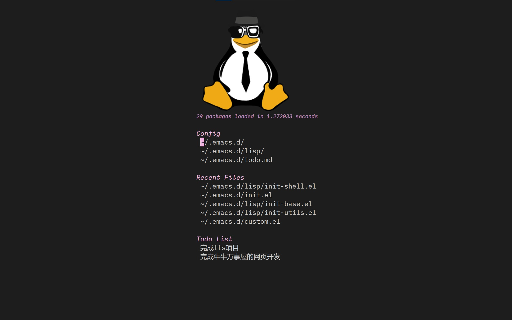
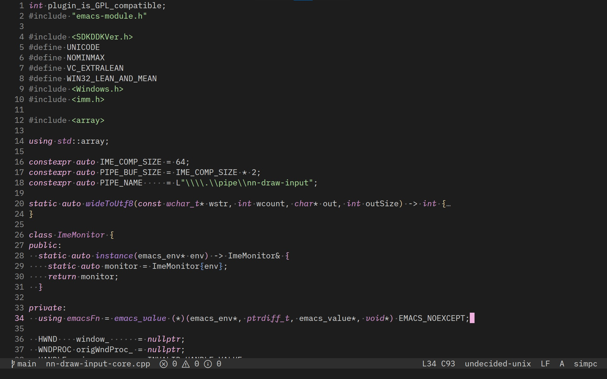

#+title: Elegant Emacs
#+property: header-args :eval never-export

#+attr_org: :center t

#+attr_org: :center t
[[https://img.shields.io/badge/Supports-Emacs_30+-purple.svg?style=flat-square&logo=GNU%20Emacs&logoColor=white]] [[https://img.shields.io/badge/License-GPLv3-blue.svg?style=flat-square]]

* Introduction

  *Elegant Emacs* is a personal Emacs 30+ configuration — fast, modular, and
  visually cohesive, without the bloat of a full framework.

  - Eglot for LSP, Corfu for completion, Apheleia for formatting, Magit for Git,
    Dape for debugging
  - Custom ~nn-world~ dark theme + Material Design icons + =*HOME*= dashboard
  - Each =init-*.el= has a single responsibility, loaded via ~require~, with
    GUI/terminal separation

* Install

  #+begin_src sh
  git clone https://github.com/zHaOdANiuu/.emacs.d.git ~/.emacs.d
  #+end_src

  Codeberg mirror: ~https://codeberg.org/zdn/.emacs.d.git~

* Highlights

  - *Fast startup* — aggressive GC tuning, JIT lock optimization, suppressed
    redisplay during init
  - *Custom theme* — ~nn-world~ dark theme, ~M-x nn-world-reload~ to live-reload
  - *=HOME*= dashboard — logo, recent files, todo list; =n/p= to navigate, =C-<f1>= to summon
  - *Completion* — Corfu (default) or completion-preview; fido-frame child-frame
    minibuffer
  - *LSP* — Eglot (manual start via context menu), =<f2>= rename, =<f12>= jump
  - *Debugging* — Dape + GDB, floating toolbar, attach to process on Windows
  - *Git* — Magit with custom status buffer, VC-dir hides subdirectories, smerge
    auto-detects conflicts
  - *Formatting* — Apheleia, =<f1>= to format; supports prettier / clang-format
    / shfmt
  - *Search* — ripgrep powers grep / xref / project; =C-c s= search directory,
    wgrep for direct editing
  - *Terminal* — Ghostel (=C-`=), MSYS2 auto-detection, Eshell with
    =clear= / =less= builtins
  - *Translation* — =C-c t w/r/b= for word / region / buffer; also in context menu
  - *Mode-line* — Git branch, diagnostics count, LSP status, encoding, line
    ending; all cached

* Screenshots

  
  
  [[./example/dir.png]]

* Modules

  | File                 | Purpose                                    |
  |----------------------+--------------------------------------------|
  | =init-package.el=      | ELPA sources + use-package + no-littering  |
  | =init-def.el=          | Custom variables, proxy, drag utilities    |
  | =init-font.el=         | IBM Plex Mono, CJK, Symbol, Emoji          |
  | =init-display.el=      | fringe, line numbers, paren, icons, indent |
  | =init-mode-line.el=    | Custom mode-line (cached)                  |
  | =init-base.el=         | Files, backups, encoding, scrolling        |
  | =init-advanced.el=     | dired, compile, isearch, ibuffer           |
  | =init-editor.el=       | Apheleia, symbol-overlay, mc, hs           |
  | =init-lang.el=         | Language major-mode entry point            |
  | =init-lsp.el=          | Eglot + xref                               |
  | =init-debug.el=        | Dape + GDB, floating toolbar               |
  | =init-diagnostics.el=  | Flymake + Flyspell                         |
  | =init-completion.el=   | Corfu / completion-preview / fido          |
  | =init-navigation.el=   | citre, bookmark, imenu-list                |
  | =init-vc.el=           | Magit, VC, ediff, smerge                   |
  | =init-www.el=          | EWW, Newsticker, Gnus, SMTP                |
  | =init-utils.el=        | webjump, grep/rg, calfw, translation       |
  | =init-terminal.el=     | shell, eshell, ghostel + MSYS2             |
  | =init-render.el=       | jit-lock tuning, markdown preview          |
  | =init-evil.el=         | Word-level movement and deletion           |
  | =init-keybind.el=      | Global keybindings                         |
  | =init-context-menu.el= | Right-click context menus                  |
  | =init-home.el=         | =*HOME*= dashboard                           |

* Requirements

  - Emacs 30+
  - Git, ripgrep (~rg~)
  - Nerd Font (Symbols Nerd Font Mono) — auto-installed if missing
  - Optional: aspell, clang-format, prettier, shfmt, GDB, ctags/readtags
